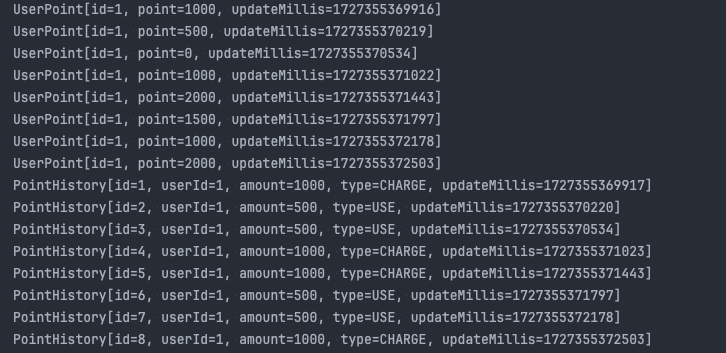
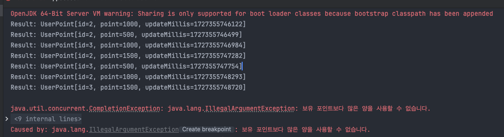
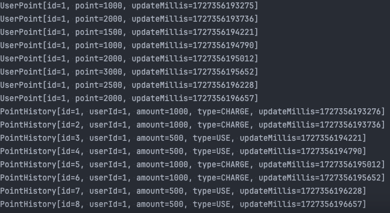
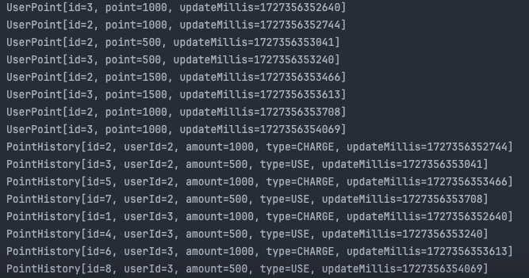

## 항해 플러스 [ 1주차 과제 ] TDD 로 개발하기

#### 요구사항
point 패키지의 TODO 와 테스트코드를 작성해주세요.

- ✅ PATCH /point/{id}/charge : 포인트를 충전한다. 
- ✅ PATCH /point/{id}/use : 포인트를 사용한다.
- ✅ GET /point/{id} : 포인트를 조회한다.
- ✅ GET /point/{id}/histories : 포인트 내역을 조회한다.
- ✅ 잔고가 부족할 경우, 포인트 사용은 실패하여야 합니다.
- ✅ 동시에 여러 건의 포인트 충전, 이용 요청이 들어올 경우 순차적으로 처리되어야 합니다.
<br>

#### `Default`

- ✅`/point` 패키지 (디렉토리) 내에 `PointService` 기본 기능 작성
- ✅`/database` 패키지의 구현체는 수정하지 않고, 이를 활용해 기능을 구현
- ✅ 각 기능에 대한 단위 테스트 작성

✅총 4가지 기본 기능 (포인트 조회, 포인트 충전/사용 내역 조회, 충전, 사용) 을 구현합니다.

```

#### `Step 1`

- ✅ 포인트 충전, 사용에 대한 정책 추가 (잔고 부족, 최대 잔고 등)
  - 포인트 충전 정책
    1. 10000 포인트 이상은 충전 불가
    2. 한번에 5000 포인트 이상은 충전불가
  
  - 포인트 사용 정책
    1. 잔고를 초과하여 사용 불가.
    2. 한번에 5000 포인트 이상은 사용불가
    
- ✅ 동시에 여러 요청이 들어오더라도 순서대로 (혹은 한번에 하나의 요청씩만) 제어될 수 있도록 리팩토링
- ✅ 동시성 제어에 대한 통합 테스트 작성
    
#### `Step 2`

- ✅ 동시성 제어 방식에 대한 분석 및 보고서 작성 ( **README.md** )

## 추가 과제 - STEP2. 동시성 제어 방식에 대한 분석 및 보고서 작성

### 동시성 제어 방식 분석 보고서
#### 1. 개요
Java의 멀티스레딩 환경에서 동시성 문제는 흔히 발생하는 과제입니다.  
여러 스레드가 동시에 동일한 자원에 접근할 경우, 자원의 일관성을 유지하기 위해 적절한 동시성 제어가 필요합니다.
Java의 전통적인 synchronized 키워드와 ReentrantLock을 사용한 동시성 제어 방식을 비교하고, 각 방식이 멀티스레드 환경에서 어떻게 동작하는지
CompletableFuture를 사용한 비동기 요청으로 테스트 하였습니다.

#### 2. synchronized를 이용한 동시성 제어
##### 2.1 synchronized 메서드

```java
public synchronized UserPoint charge(long id, long amount);
public synchronized UserPoint use(long id, long amount);
```
synchronized 키워드는 Java에서 기본적으로 동시성을 제어하기 위해 제공되는 방법입니다.
해당 키워드를 사용하면 동일한 자원에 대해 동시에 여러 스레드가 접근하지 못하도록 막을 수 있습니다.
아래는 CompletableFuture를 사용해 비동기적으로 charge와 use 메서드를 호출한 예입니다.

```java
// given
CompletableFuture.allOf(
        CompletableFuture.supplyAsync(() -> pointService.charge(1L, 1000L)).thenAccept(System.out::println),
        CompletableFuture.supplyAsync(() -> pointService.charge(1L, 1000L)).thenAccept(System.out::println),
        CompletableFuture.supplyAsync(() -> pointService.use(1L, 500L)).thenAccept(System.out::println),
        CompletableFuture.supplyAsync(() -> pointService.use(1L, 500L)).thenAccept(System.out::println),
        CompletableFuture.supplyAsync(() -> pointService.charge(1L, 1000L)).thenAccept(System.out::println),
        CompletableFuture.supplyAsync(() -> pointService.charge(1L, 1000L)).thenAccept(System.out::println),
        CompletableFuture.supplyAsync(() -> pointService.use(1L, 500L)).thenAccept(System.out::println),
        CompletableFuture.supplyAsync(() -> pointService.use(1L, 500L)).thenAccept(System.out::println)
).join();
```



테스트 결과 순차적으로 요청 되었으나, 테스트의 마지막 CHARGE 인걸로 봐서, 순차적으로 처리 되지 않은 것으로 판단됩니다. 

이 방식에서는 동일한 자원에 대한 동시 접근을 방지하지만, 
실행 순서가 보장되지 않습니다. 즉, 어떤 스레드가 먼저 자원을 획득할지 예측할 수 없으므로, 순차적인 결과를 기대하기 어렵습니다.

또한 두명이상의 유저가 접근 하였을 때도 문제가 발생합니다.
다음은 유저2, 유저3 이 각각 교차로 충전과 사용을 비동기적으로 요청한 테스트 코드입니다.

```java
CompletableFuture.allOf(
                CompletableFuture.supplyAsync(() -> pointService.charge(2L, 1000L)).thenAccept(result -> System.out.println("Result: " + result)),
                CompletableFuture.supplyAsync(() -> pointService.charge(3L, 1000L)).thenAccept(result -> System.out.println("Result: " + result)),
                CompletableFuture.supplyAsync(() -> pointService.use(2L, 500L)).thenAccept(result -> System.out.println("Result: " + result)),
                CompletableFuture.supplyAsync(() -> pointService.use(3L, 500L)).thenAccept(result -> System.out.println("Result: " + result)),
                CompletableFuture.supplyAsync(() -> pointService.charge(2L, 1000L)).thenAccept(result -> System.out.println("Result: " + result)),
                CompletableFuture.supplyAsync(() -> pointService.charge(3L, 1000L)).thenAccept(result -> System.out.println("Result: " + result)),
                CompletableFuture.supplyAsync(() -> pointService.use(2L, 500L)).thenAccept(result -> System.out.println("Result: " + result)),
                CompletableFuture.supplyAsync(() -> pointService.use(3L, 500L)).thenAccept(result -> System.out.println("Result: " + result))
        ).join();
```


2명이상의 유저가 접근 될 경우, 제대로 무결성을 보장하지 못하는 것을 알 수 있습니다.

##### 2.2 문제점
- 순서 보장 불가: 여러 스레드가 경쟁적으로 자원을 요청할 때, 자원 획득 순서가 보장되지 않으며, 이는 예상하지 못한 결과를 초래할 수 있습니다.
- 공정성 부족: synchronized는 스레드가 자원을 획득하는 순서를 제어하지 않으므로, 기아 상태(starvation)가 발생할 수 있습니다. 즉, 특정 스레드가 자원을 오랜 시간 동안 획득하지 못하는 상황이 발생할 수 있습니다.
- 범위 설정: lock 방식의 비해 범위를 설정하는 선택의 수가 적습니다. (메서드 단위, 변수 단위 등)

#### 3. ReentrantLock + ConcurrentHashMap을 이용한 동시성 제어
##### 3.1 ReentrantLock과 ConcurrentHashMap
ReentrantLock은 synchronized보다 더 유연한 동시성 제어 메커니즘을 제공합니다. 
특히, 공정성(fairness) 옵션을 통해 더 오래 대기한 스레드가 먼저 자원을 획득할 수 있도록 할 수 있습니다. 
또한, ConcurrentHashMap과 결합하여 각 사용자별로 고유한 락을 부여함으로써 사용자별로 동시성을 제어할 수 있습니다.

``` java
    // 각 회원 id 에 따른 동시성 보장
    ReentrantLock lock = userMap.computeIfAbsent(id, userId -> new ReentrantLock());
    lock.lock();

    try {
        // amount 검증
        long validChargeAmount = pointValidator.verifyChargeAmount(amount);
        // 검증된 amount 를 통한 충전 이후 포인트 총합 계산
        long calculatedChargePoint =  defaultUserPointRepository.selectById(id).calculateChargePoint(validChargeAmount);
        // totalPoint 검증
        long validTotalPoint = pointValidator.verifyChargePoint(calculatedChargePoint);

        // 최종 검증된 포인트로 업데이트
        UserPoint returnUserPoint = defaultUserPointRepository.insertOrUpdate(id, validTotalPoint);

        // 포인트 히스토리 기록
        defaultPointHistoryRepository.insert(id, amount, TransactionType.CHARGE, System.currentTimeMillis());

        return returnUserPoint;

    } finally {
        lock.unlock();
    }
```
이 방식은 각 사용자 ID 마다 락을 설정하여 동일한 사용자의 포인트 작업에 대해서만 동시성을 제어하고, 다른 사용자 작업은 병렬로 처리할 수 있도록 합니다.


유저 1에 대한 충전, 사용이 순차적으로 이루어 지고 있음을 알 수 있습니다.


유저 2,3 의 요청의 완료 시간은 비동기 적이나, 히스토리를 열람했을때 순차적으로 잘 들어 간것이 확인됩니다.

##### 3.2 장점
공정성 보장: ReentrantLock은 오래 기다린 스레드가 먼저 자원을 획득할 수 있도록 공정성을 보장할 수 있습니다.
명시적인 동시성 제어: lock()과 unlock()을 사용하여 더 유연하게 동시성 제어가 가능합니다.
순서 보장 가능: 사용자별로 락을 관리함으로써 순차적 실행을 강제할 수 있습니다. 이는 synchronized보다 더욱 세밀한 동시성 제어가 가능합니다.

##### 4 정리

자원의 순차적인 사용, 공정성, 설정 범위를 고려 하였을 때,
지금 작성중인 코드에는 ReentrantLock + ConcurrentHashMap을 사용한 동시성 제어 방식이 적합하다고 느껴 채택 하게 되었습니다. 보통 Transaction 같은 DB 기반의 동시성 제어를 많이 접했던 것 같은데, JAVA 코드레벨 적으로 동시성을 제어 하여 멀티 쓰레드 환경에도 순차적으로 동시성을 보장할 수 있는 방법을 터득한 계기가 되었던 것 같습니다.

----
#### 커밋태그

| 태그       | 설명                                 |
|:---------|:----------------------------------------|
| feat     | 새로운 기능 추가                          |
| fix      | 버그 수정                                 |
| refactor | 코드 리팩토링                             |
| comment  | 주석 추가(코드 변경 X) 혹은 오타 수정      |
| docs     | README와 같은 문서 수정     |
| merge    | merge                                      |
| rename   | 파일, 폴더 수정, 삭제 혹은 이동            |
| report   | 해당 주차별 과제 등록 및 풀이               |
| chore    | 설정 변경                                   |
